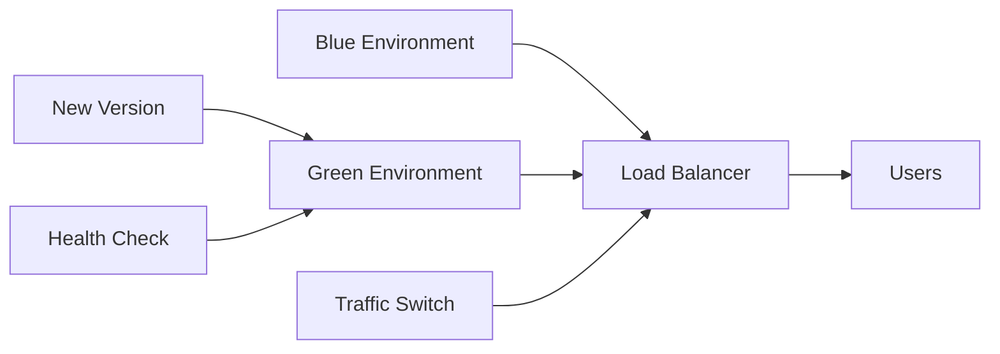
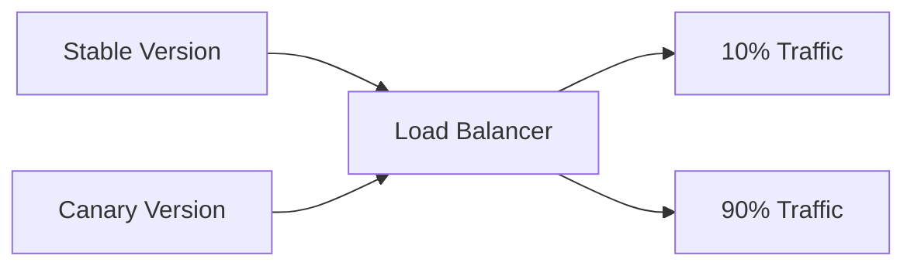

# CBL-MAIKOSH CI/CD Pipeline Documentation

## 🏀 Basketball Coaching Platform - Enterprise CI/CD Implementation

### Table of Contents
- [Overview](#overview)
- [Pipeline Architecture](#pipeline-architecture)
- [Environment Strategy](#environment-strategy)
- [Deployment Strategies](#deployment-strategies)
- [Security Implementation](#security-implementation)
- [Monitoring & Alerting](#monitoring--alerting)
- [Runbooks](#runbooks)
- [Troubleshooting](#troubleshooting)

## Overview

The CBL-MAIKOSH CI/CD pipeline implements enterprise-grade deployment automation with comprehensive testing, security scanning, and deployment strategies tailored for each environment. The pipeline ensures zero-downtime deployments while maintaining the highest standards of security and reliability.

### Key Features

- **Multi-Environment Support**: Dev, Staging, Production
- **Advanced Deployment Strategies**: Blue-Green, Canary, Direct
- **Comprehensive Testing**: Unit, Integration, Security, Performance
- **Automated Rollback**: Intelligent failure detection and automatic rollback
- **Infrastructure as Code**: Terraform integration for consistent infrastructure
- **Monitoring Integration**: Real-time monitoring and alerting
- **Security First**: Container scanning, vulnerability assessment, security policies

## Pipeline Architecture

### 1. Cloud Build Pipelines

#### Enhanced Pipeline (`cloudbuild-enhanced.yaml`)
Comprehensive 18-stage pipeline for all environments:

1. **Environment Setup & Validation**
2. **Cache Management** (Build cache optimization)
3. **Dependency Installation**
4. **Code Quality & Linting**
5. **Unit Testing**
6. **Integration Testing**
7. **Security Vulnerability Scanning**
8. **Application Build**
9. **Cache Update**
10. **Container Security Scanning**
11. **Container Build & Tag**
12. **Container Push**
13. **Infrastructure Validation (Terraform)**
14. **Environment-specific Deployment**
15. **Health Checks**
16. **Performance Testing** (Production only)
17. **Notifications & Reporting**

#### Environment-Specific Pipelines

**Development (`cloudbuild-dev.yaml`)**
- Fast feedback loop (15 minutes)
- Basic testing and linting
- Direct deployment strategy
- Minimal resource allocation
- Quick health checks

**Staging (`cloudbuild-staging.yaml`)**
- Comprehensive testing (40 minutes)
- Canary deployment strategy
- Full integration test suite
- Container security scanning
- Performance validation

**Production (`cloudbuild-production.yaml`)**
- Maximum security and validation (60 minutes)
- Blue-green deployment strategy
- Complete test coverage
- Infrastructure validation
- Gradual traffic switching
- Comprehensive monitoring

### 2. GitHub Actions Workflows

#### Main CI/CD Pipeline (`ci-cd-main.yml`)
- Triggered on main branch and pull requests
- Multi-job architecture with parallel execution
- Environment-specific deployment logic
- Artifact management and reporting

#### Feature Branch Pipeline (`feature-branch.yml`)
- Automatic feature branch deployments
- Temporary environment provisioning
- PR integration with deployment links
- Automatic cleanup on branch deletion

## Environment Strategy

### Development Environment
- **Purpose**: Rapid development and testing
- **Deployment**: Direct strategy
- **Resources**: 512Mi memory, 1 CPU, 0-5 instances
- **Testing**: Unit tests and basic linting
- **Monitoring**: Basic health checks

### Staging Environment
- **Purpose**: Pre-production validation
- **Deployment**: Canary strategy (10% → 100% traffic)
- **Resources**: 1Gi memory, 1 CPU, 1-20 instances
- **Testing**: Full test suite including integration tests
- **Monitoring**: Comprehensive monitoring with 5-minute canary validation

### Production Environment
- **Purpose**: Live customer-facing application
- **Deployment**: Blue-green strategy (5% → 50% → 100% traffic)
- **Resources**: 2Gi memory, 2 CPU, 2-100 instances
- **Testing**: Complete test coverage + performance testing
- **Monitoring**: Real-time monitoring with automatic rollback

## Deployment Strategies

### 1. Blue-Green Deployment (Production)



**Process:**
1. Deploy new version (Green) with 0% traffic
2. Comprehensive health validation
3. Gradual traffic switch: 5% → 50% → 100%
4. Monitor at each stage with automatic rollback
5. Clean up old Blue environment

**Benefits:**
- Zero downtime
- Instant rollback capability
- Production validation before full deployment
- Risk mitigation through gradual traffic shift

### 2. Canary Deployment (Staging)



**Process:**
1. Deploy canary version with 0% traffic
2. Route 10% of traffic to canary
3. Monitor for 5 minutes with health checks
4. Promote to 100% traffic if successful
5. Automatic rollback on failure

### 3. Direct Deployment (Development)

Simple deployment strategy for rapid iteration:
1. Build and deploy immediately
2. Basic health check validation
3. Immediate availability

## Security Implementation

### Container Security
- **Base Image Scanning**: Regular vulnerability scans
- **Dependency Scanning**: npm audit integration
- **Container Image Scanning**: GCP Container Analysis API
- **Runtime Security**: Non-root user execution
- **Secret Management**: Google Secret Manager integration

### Access Control
- **Service Accounts**: Least privilege access
- **IAM Policies**: Environment-specific permissions
- **Network Security**: VPC and firewall rules
- **Encryption**: Data encryption at rest and in transit

### Security Pipeline Stages
1. **Dependency Vulnerability Scanning**
2. **Container Security Scanning**
3. **Infrastructure Security Validation**
4. **Runtime Security Monitoring**

## Monitoring & Alerting

### Metrics Collection
- **Application Metrics**: Response times, error rates, throughput
- **Infrastructure Metrics**: CPU, memory, instance count
- **Business Metrics**: User engagement, course completions
- **Security Metrics**: Authentication failures, security events

### Alert Policies
- **High Error Rate**: > 5% for 5 minutes
- **High Response Time**: > 10 seconds for 5 minutes
- **Low Instance Count**: < 1 instance for 2 minutes (production)
- **High Memory Utilization**: > 85% for 5 minutes
- **Security Events**: Authentication failures, suspicious activity

### Dashboards
- **CBL-MAIKOSH Platform Dashboard**: Real-time metrics
- **Environment-specific dashboards**: Dev, Staging, Production views
- **Security Dashboard**: Security metrics and events

## Runbooks

### Deployment Runbook

#### Deploying to Development
```bash
# Using Cloud Build
gcloud builds submit --config cloudbuild-dev.yaml

# Using deployment script
./scripts/deploy-with-rollback.sh dev latest
```

#### Deploying to Staging
```bash
# Using Cloud Build
gcloud builds submit --config cloudbuild-staging.yaml

# Using deployment script
./scripts/deploy-with-rollback.sh staging v1.2.3
```

#### Deploying to Production
```bash
# Using Cloud Build (production pipeline)
gcloud builds submit --config cloudbuild-production.yaml

# Using deployment script with validation
PROJECT_ID=zeidgeistdotcom ./scripts/deploy-with-rollback.sh prod v1.2.3
```

### Rollback Runbook

#### Immediate Rollback (Production Emergency)
```bash
# Get current service information
gcloud run services describe cbl-maikosh-app-prod --region=us-central1

# List recent revisions
gcloud run revisions list --service=cbl-maikosh-app-prod --region=us-central1

# Rollback to previous revision
gcloud run services update-traffic cbl-maikosh-app-prod \
  --to-revisions=PREVIOUS_REVISION_NAME=100 \
  --region=us-central1

# Verify rollback
curl -f https://cbl-maikosh-app-prod-PROJECT_ID.a.run.app/api/health
```

#### Gradual Rollback (Staged)
```bash
# Gradually shift traffic back to stable version
gcloud run services update-traffic cbl-maikosh-app-prod \
  --to-revisions=STABLE_REVISION=50,CURRENT_REVISION=50 \
  --region=us-central1

# Monitor for issues, then complete rollback
gcloud run services update-traffic cbl-maikosh-app-prod \
  --to-revisions=STABLE_REVISION=100 \
  --region=us-central1
```

### Monitoring Setup Runbook

#### Initial Setup
```bash
# Set environment variables
export PROJECT_ID=zeidgeistdotcom
export EMAIL_RECIPIENTS=admin@company.com
export SLACK_CHANNEL=https://hooks.slack.com/your-webhook

# Run monitoring setup
./scripts/monitoring-setup.sh
```

#### Dashboard Access
1. Navigate to [Google Cloud Monitoring](https://console.cloud.google.com/monitoring)
2. Select "Dashboards" from the left menu
3. Open "CBL-MAIKOSH Platform Dashboard"
4. Configure alert policies and notification channels

### Infrastructure Management

#### Terraform Operations
```bash
# Initialize Terraform
cd terraform
terraform init -backend-config="bucket=cbl-maikosh-terraform-state-PROJECT_ID"

# Plan infrastructure changes
terraform plan -var="project_id=PROJECT_ID" -var="environment=prod"

# Apply infrastructure changes
terraform apply -var="project_id=PROJECT_ID" -var="environment=prod"

# Validate infrastructure
terraform validate
```

#### Resource Management
```bash
# Check Cloud Run services
gcloud run services list --region=us-central1

# Check container images
gcloud artifacts docker images list us-central1-docker.pkg.dev/PROJECT_ID/cbl-maikosh-repo/cbl-maikosh-app

# Check build history
gcloud builds list --limit=20

# Check logs
gcloud logs read "resource.type=cloud_run_revision" --limit=50
```

## Troubleshooting

### Common Issues

#### Build Failures

**Dependency Installation Failures**
```bash
# Check npm logs
gcloud logs read "resource.type=cloud_build" "npm install" --limit=10

# Clear npm cache
npm cache clean --force

# Update package-lock.json
npm ci --package-lock-only
```

**Test Failures**
```bash
# Run tests locally
npm test

# Check test coverage
npm test -- --coverage

# Run specific test suite
npm test -- --testPathPattern="integration"
```

#### Deployment Failures

**Health Check Failures**
1. Check application logs
2. Verify environment variables
3. Validate secrets configuration
4. Test endpoints manually

```bash
# Check Cloud Run logs
gcloud logs read "resource.type=cloud_run_revision" --limit=20

# Test health endpoint
curl -v https://SERVICE_URL/api/health

# Check service configuration
gcloud run services describe SERVICE_NAME --region=us-central1
```

**Traffic Routing Issues**
```bash
# Check current traffic allocation
gcloud run services describe SERVICE_NAME --region=us-central1 \
  --format="value(status.traffic[].percent,status.traffic[].revisionName)"

# Reset traffic to latest
gcloud run services update-traffic SERVICE_NAME --to-latest --region=us-central1
```

#### Performance Issues

**High Response Times**
1. Check monitoring dashboard
2. Analyze application logs
3. Review resource allocation
4. Scale instances if needed

```bash
# Increase instance limits
gcloud run services update SERVICE_NAME \
  --max-instances=200 \
  --region=us-central1

# Increase memory allocation
gcloud run services update SERVICE_NAME \
  --memory=4Gi \
  --region=us-central1
```

**High Error Rates**
1. Check error logs
2. Validate database connections
3. Review authentication configuration
4. Check external service dependencies

### Emergency Procedures

#### Production Incident Response
1. **Immediate Assessment**
   - Check monitoring dashboards
   - Verify service health status
   - Assess impact scope

2. **Emergency Rollback**
   ```bash
   # Immediate rollback to last stable version
   gcloud run services update-traffic cbl-maikosh-app-prod \
     --to-latest --region=us-central1
   ```

3. **Communication**
   - Notify stakeholders
   - Update status page
   - Document incident

4. **Investigation**
   - Collect logs and metrics
   - Identify root cause
   - Plan resolution

5. **Recovery**
   - Implement fix
   - Test thoroughly
   - Gradual re-deployment

## Best Practices

### Development Workflow
1. **Feature Branches**: Create feature branches for all changes
2. **Pull Requests**: Mandatory code review process
3. **Testing**: Comprehensive test coverage
4. **Documentation**: Update documentation with changes

### Deployment Practices
1. **Gradual Rollouts**: Always use staged deployments for production
2. **Health Checks**: Implement comprehensive health validation
3. **Monitoring**: Monitor key metrics during deployments
4. **Rollback Plans**: Always have rollback procedures ready

### Security Practices
1. **Regular Scans**: Schedule regular security scans
2. **Secret Rotation**: Rotate secrets regularly
3. **Access Reviews**: Regular access permission reviews
4. **Audit Logs**: Monitor and audit all access

### Performance Optimization
1. **Resource Monitoring**: Regular resource usage review
2. **Load Testing**: Regular load testing for capacity planning
3. **Caching**: Implement appropriate caching strategies
4. **Code Optimization**: Regular code performance reviews

## Support and Maintenance

### Regular Maintenance Tasks
- **Weekly**: Review monitoring alerts and performance metrics
- **Monthly**: Update dependencies and security patches
- **Quarterly**: Infrastructure and security reviews
- **Annually**: Comprehensive architecture review

### Documentation Updates
- Update runbooks after incident resolutions
- Document new procedures and configurations
- Maintain troubleshooting guides
- Keep contact information current

### Contact Information

**Primary Contacts:**
- DevOps Team: devops@cbl-maikosh.com
- Security Team: security@cbl-maikosh.com
- Development Team: dev@cbl-maikosh.com

**Emergency Contacts:**
- On-call Engineer: +1-XXX-XXX-XXXX
- Platform Lead: +1-XXX-XXX-XXXX

---

*This documentation was generated as part of the CBL-MAIKOSH CI/CD pipeline implementation. Last updated: $(date)*